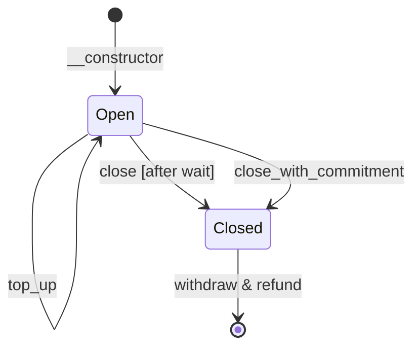

# Channel

A unidirectional payment channel contract for Soroban (Stellar).

A funder (`from`) deposits tokens into a channel contract destined for a
recipient (`to`). The funder issues off-chain signed commitments for increasing
amounts. The recipient can close the channel at any time to claim the
authorized amount, and the funder can reclaim the remainder.

## How it works

1. **Open** -- Deploy the contract with the token, funder, recipient, commitment
   key, initial deposit, and close ledger count.
2. **Off-chain** -- The funder signs commitments (using `prepare_commitment` to
   get the payload) for increasing amounts and sends them to the recipient.
3. **Close with commitment** -- The recipient closes the channel with a
   commitment. This is the typical way to close a channel.
4. **Close** -- If the recipient doesn't close the channel, the funder can
   close it. The close becomes effective after a waiting period, resulting
   in a full refund. During the waiting period the recipient can update the
   amount by calling `close_with_commitment`.
5. **Withdraw** -- After close is effective, anyone calls `withdraw` to transfer
   the closed amount to the recipient.
6. **Refund** -- After close is effective, the funder calls `refund` to reclaim
   the remainder.

## State diagram

## Functions

| Function | Description | Who can call | Auth required |
|---|---|---|---|
| `__constructor` | Deploy the contract with the token, funder, recipient, commitment key, initial deposit, and close ledger count. | Deployer | `from` |
| `top_up` | Top up the channel with the stored token from the stored from address. | Anyone | `from` |
| `prepare_commitment` | Returns the commitment payload that needs to be signed by the commitment_key. | Anyone | None |
| `balance_deposited` | Returns the total amount deposited in the channel. | Anyone | None |
| `close` | Close the channel with amount 0, effective after a waiting period. The recipient can update the amount with `close_with_commitment`. | Funder | `from` |
| `close_with_commitment` | Close the channel by submitting a commitment. Effective immediately. | Recipient | `to` + commitment sig |
| `withdraw` | Withdraw the authorized amount to `to` after the close is effective. | Anyone | None |
| `refund` | Refund the funder's portion of the balance after the close is effective. | Funder | `from` |

## Commitment format

The commitment is a `Commitment` struct serialized to XDR (ScVal Map):

| Field | Type | Value |
|---|---|---|
| `prefix` | Symbol | `chancmmt` |
| `channel` | Address | Channel contract address |
| `amount` | i128 | Authorized amount |

The funder signs the XDR bytes with their ed25519 key
(`commitment_key`). The signature never expires.
