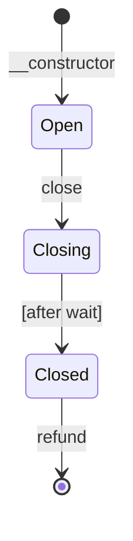

# Channel

A unidirectional payment channel contract for Soroban (Stellar).

A funder (`from`) deposits tokens into a channel contract destined for a
recipient (`to`). The funder issues off-chain signed commitments for increasing
amounts. The recipient can withdraw at any time to claim the committed amount,
and the funder can close the channel to reclaim the remainder.

## How it works

1. **Open** -- Deploy the contract with the token, funder, recipient, commitment
   key, initial deposit, and refund waiting period.
2. **Off-chain** -- The funder signs commitments (using `prepare_commitment` to
   get the payload) for increasing amounts and sends them to the recipient.
3. **Withdraw** -- The recipient withdraws at any time with a commitment, receiving
   the committed amount. The commitment amount is the total amount, so only the
   difference from previous withdrawments is transferred.
4. **Close** -- The funder closes the channel. The close becomes effective after
   a waiting period. During the waiting period the recipient can still withdraw.
5. **Refund** -- After the close is effective, the funder calls `refund` to
   reclaim the remaining balance.

## State diagram

`top_up` and `withdraw` can be called in any state. After `refund` the
channel balance is zero so there is nothing left to withdraw.

## Functions

| Function | Description | Who can call | Auth required |
|---|---|---|---|
| `__constructor` | Deploy the contract with the token, funder, recipient, commitment key, initial deposit, and refund waiting period. | Deployer | `from` |
| `top_up` | Top up the channel with the stored token from the stored from address. | Anyone | `from` |
| `prepare_commitment` | Returns the commitment payload that needs to be signed by the commitment_key. | Anyone | None |
| `deposited` | Returns the total amount deposited into the channel. | Anyone | None |
| `balance` | Returns the balance of the channel. This is the deposited amount minus any amount already withdrawn. | Anyone | None |
| `withdrawn` | Returns the total cumulative amount already withdrawn by the recipient. | Anyone | None |
| `withdraw` | Withdraw funds to the recipient using a signed commitment. The amount is the total cumulative entitlement; only the difference from previous withdrawals is transferred. Can be called at any time. | Recipient | `to` + commitment sig |
| `close` | Close the channel, effective after a waiting period. The recipient can still withdraw during the wait. | Funder | `from` |
| `refund` | Refund the remaining balance to the funder after the close is effective. | Funder | `from` |

## Commitment format

The commitment is a `Commitment` struct serialized to XDR (ScVal Map):

| Field | Type | Value |
|---|---|---|
| `domain` | Symbol | `chancmmt` |
| `channel` | Address | Channel contract address |
| `amount` | i128 | Committed amount |

The funder signs the XDR bytes with their ed25519 key
(`commitment_key`). The signature never expires.
