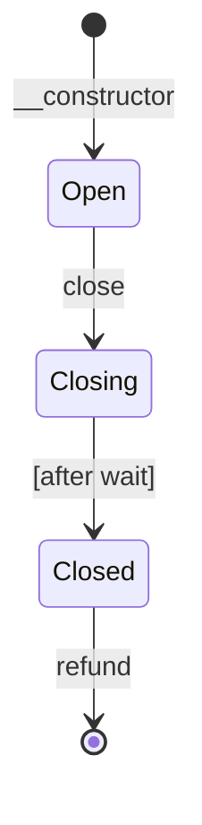

# Channel

A unidirectional payment channel contract for Soroban (Stellar).

A payment channel allows a funder to make many small payments to a recipient
off-chain, with only two on-chain transactions: opening the channel and
closing it. This avoids per-payment transaction fees and latency.

> [!WARNING]
> **The contracts in this repository have not been audited.**

## Participants

- **Funder (`from`)**: Deposits tokens into the channel and signs
  commitments authorizing the recipient to withdraw up to a given cumulative
  amount.
- **Recipient (`to`)**: Receives commitments off-chain and can withdraw
  funds on-chain at any time using a signed commitment.

## Expectations

Participants have the following responsibilities to receive the funds owing
to them.

### Funder

- None.

### Recipient

- Verifies the `refund_waiting_period` at channel creation is long
  enough to allow them to react to a close event.
- Verifies the `amount` in each commitment is less than the channels
  deposited amount.
- Monitors the channel for [`event::Close`] events.
- Calls `withdraw` with the highest-value commitment promptly after seeing a
  close event, before the refund waiting period elapses.

## State diagram



`top_up` and `withdraw` can be called in any state. After `refund` the
channel balance is zero so there is nothing left to withdraw.

## Functions

### Lifecycle

| Function | Description |
|---|---|
| `__constructor` | Open a channel with an initial deposit. Callable by the funder, or anyone if amount is zero. |
| `top_up` | Deposit additional tokens into the channel. |
| `withdraw` | Withdraw funds using a signed commitment. |
| `close` | Begin closing the channel, effective after a waiting period. |
| `refund` | Refund the remaining balance to the funder after the close is effective. |

### Helpers

| Function | Description |
|---|---|
| `prepare_commitment` | Generate the commitment bytes to sign. |

### Getters

| Function | Description |
|---|---|
| `token` | Returns the token address. |
| `from` | Returns the funder address. |
| `to` | Returns the recipient address. |
| `refund_waiting_period` | Returns the refund waiting period in ledgers. |
| `deposited` | Returns the total amount deposited. |
| `withdrawn` | Returns the total amount already withdrawn. |
| `balance` | Returns the current balance (deposited minus withdrawn). |

## Lifecycle

### 1. Open

The channel is deployed with a SEP-41 token, funder address, recipient
address, an ed25519 `commitment_key` (public key), an initial deposit
amount, and a `refund_waiting_period` (in ledgers).

The funder's tokens are transferred into the channel contract on deployment.
The funder can also top up the channel later using [`Contract::top_up`], or
by transferring the token directly to the channel contract address.

### 2. Off-chain payments

The funder makes payments by signing commitments off-chain and sending them
to the recipient. A commitment authorizes the recipient to withdraw up to a
**cumulative total** amount. Each new commitment replaces the previous one.

For example:
- Commitment for 100: recipient can withdraw up to 100.
- Commitment for 140: recipient can withdraw up to 140 (40 more if 100 was
  already withdrawn).
- Commitment for 300: recipient can withdraw up to 300 (160 more if 140 was
  already withdrawn).

A commitment is an XDR serialized [`Commitment`] struct containing a domain
separator (`chancmmt`), the network ID, the channel contract address, and
the amount. The
funder signs the serialized bytes with the ed25519 key corresponding to the
`commitment_key`. Use [`Contract::prepare_commitment`] as a convenience to
generate the bytes to sign.

The serialized commitment is an XDR `ScVal::Map` with four entries
(sorted alphabetically by key):

```text
ScVal::Map({
    Symbol("amount"):  I128(amount),
    Symbol("channel"): Address(channel_contract_address),
    Symbol("domain"):  Symbol("chancmmt"),
    Symbol("network"): BytesN<32>(network_id),
})
```

### 3. Withdraw

The recipient calls [`Contract::withdraw`] at any time with a commitment
amount and its signature. The contract verifies the signature, then
transfers the difference between the commitment amount and what has already
been withdrawn. If the commitment amount is less than or equal to what has
already been withdrawn, no transfer occurs.

The recipient does not need to withdraw after every commitment. They can
accumulate multiple commitments and withdraw using only the latest (highest
amount) commitment.

### 4. Close

The funder calls [`Contract::close`] to begin closing the channel. The close
does not take effect immediately — there is a waiting period of
`refund_waiting_period` ledgers.

The recipient can still call [`Contract::withdraw`] at any time, including
after the waiting period has elapsed, up until the funder calls
[`Contract::refund`]. However, once the waiting period has elapsed the
funder can call refund at any time, so the recipient should withdraw
promptly.

**Important:** The recipient should monitor for [`event::Close`] events and
withdraw before the close becomes effective.

### 5. Refund

After the refund waiting period has elapsed, the funder calls
[`Contract::refund`] to reclaim whatever balance remains in the channel.
This transfers the **entire** remaining token balance to the funder,
including any amount the recipient was entitled to but did not withdraw.
The contract does not reserve funds for the recipient. If the recipient
has not withdrawn before the funder calls refund, those funds are lost to
the recipient and assumed to be of no interest to the recipient.

## Security

- Commitments are signed with an ed25519 key, not a Stellar account. The
  `commitment_key` is set at deployment and cannot be changed.
- The commitment includes a domain separator, the network ID, and the
  channel contract address, preventing signatures from being reused across
  networks, channels, or confused with other signed payloads.
- The refund waiting period protects the recipient: it gives them time to
  withdraw using their latest commitment before the funder can reclaim
  funds.

# Channel Factory

A factory contract for opening channel contracts on Soroban (Stellar).

The factory stores a channel contract wasm hash and opens new channel
instances using it. An admin can update the wasm hash to open newer
versions of the channel contract.

## Functions

| Function | Description |
|---|---|
| `__constructor` | Initialize the factory with an admin and channel wasm hash. |
| `set_wasm` | Update the stored channel wasm hash. Admin only. |
| `open` | Deploy a new channel contract with the given parameters. |
| `admin` | Returns the admin address. |
| `wasm_hash` | Returns the stored channel wasm hash. |
