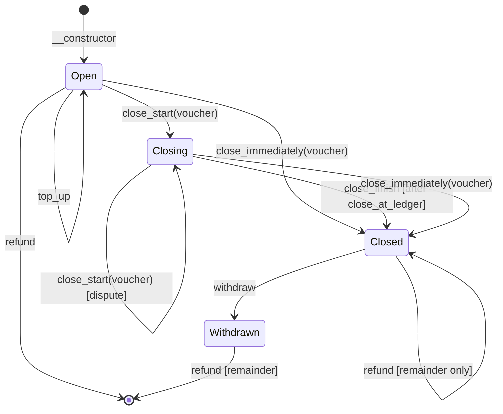

# Channel

A unidirectional payment channel contract for Soroban (Stellar).

A funder (`from`) deposits tokens into a channel contract destined for a
recipient (`to`). The funder issues off-chain signed vouchers for increasing
amounts. The recipient can close the channel at any time to claim the
authorized amount, and the funder can reclaim the remainder.

## How it works

1. **Open** -- Deploy the contract with the token, funder, recipient, voucher
   auth key, initial deposit, and close ledger count.
2. **Off-chain** -- The funder signs vouchers (using `prepare_voucher` to get
   the payload) for increasing amounts and sends them to the recipient.
3. **Close immediately** -- The recipient closes the channel immediately with a
   voucher. This is the typical way to close a channel.
4. **Close start/finish** -- If the recipient doesn't close the channel, anyone
   with a voucher (e.g. the funder) can start a close. After a waiting period
   anyone can finish the close. During the waiting period the close can be
   disputed with a newer voucher.
5. **Withdraw** -- After close, anyone calls `withdraw` to transfer the closed
   amount to the recipient.
6. **Refund** -- The funder calls `refund` to reclaim the remainder.

## State diagram

## Functions

| Function | Description | Who can call | Auth required |
|---|---|---|---|
| `__constructor` | Deploy the contract with the token, funder, recipient, voucher auth key, initial deposit, and close ledger count. | Deployer | `from` |
| `top_up` | Top up the channel with the stored token from the stored from address. | Anyone | `from` |
| `prepare_voucher` | Returns the voucher payload that needs to be signed by the from_voucher_auth_key. | Anyone | None |
| `balance_deposited` | Returns the total amount deposited in the channel. | Anyone | None |
| `close_start` | Start closing the channel by submitting a voucher. Can be called again to overwrite a pending close. | Anyone with voucher | None (voucher sig) |
| `close_finish` | Finish the close after the close_at_ledger has been reached. Marks the channel as closed with the authorized amount. | Anyone | None |
| `close_immediately` | Close the channel immediately by submitting a voucher. No waiting period. | Recipient | `to` + voucher sig |
| `withdraw` | Withdraw the authorized amount to `to` after the channel is closed. | Anyone | None |
| `refund` | Refund the funder's portion of the balance. Can be called after the channel is closed. | Funder | `from` |

## Voucher format

The voucher is a `Voucher` struct serialized to XDR (ScVal Map):

| Field | Type | Value |
|---|---|---|
| `prefix` | Symbol | `chanvchr` |
| `channel` | Address | Channel contract address |
| `token` | Address | SEP-41 token address |
| `amount` | i128 | Authorized amount |

The funder signs the XDR bytes with their ed25519 key
(`from_voucher_auth_key`). The signature never expires.
