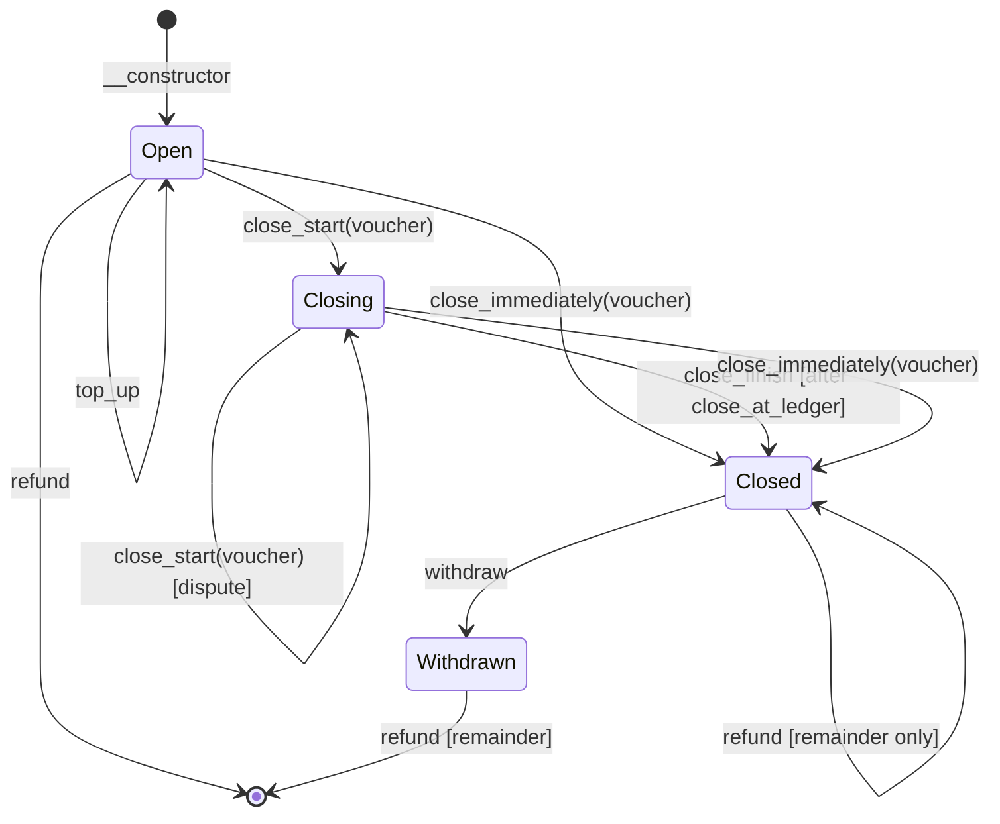

# Channel

A unidirectional payment channel contract for Soroban (Stellar).

A funder (`from`) deposits tokens into a channel contract destined for a
recipient (`to`). The funder issues off-chain signed vouchers for increasing
amounts. The recipient can close the channel at any time to claim the
authorized amount, and the funder can reclaim the remainder.

## How it works

1. **Open** -- Deploy the contract with the token, funder, recipient, voucher
   auth key, initial deposit, and close ledger count.
2. **Off-chain** -- The funder signs vouchers (using `prepare_voucher` to get
   the payload) for increasing amounts and sends them to the recipient.
3. **Close** -- The recipient (or anyone with a voucher) closes the channel.
4. **Withdraw** -- After close, anyone calls `withdraw` to transfer the closed
   amount to the recipient.
5. **Refund** -- The funder calls `refund` to reclaim the remainder.

## State diagram

## Functions

| Function | Who can call | Auth required |
|---|---|---|
| `top_up` | Anyone | `from` |
| `prepare_voucher` | Anyone | None |
| `balance_deposited` | Anyone | None |
| `close_start` | Anyone with voucher | None (voucher sig) |
| `close_finish` | Anyone | None |
| `close_immediately` | Recipient | `to` + voucher sig |
| `withdraw` | Anyone | None |
| `refund` | Funder | `from` |

## Voucher format

The voucher is a `Voucher` struct serialized to XDR (ScVal Map):

| Field | Type | Value |
|---|---|---|
| `prefix` | Symbol | `chanvchr` |
| `channel` | Address | Channel contract address |
| `token` | Address | SEP-41 token address |
| `amount` | i128 | Authorized amount |

The funder signs the XDR bytes with their ed25519 key
(`from_voucher_auth_key`). The signature never expires.
