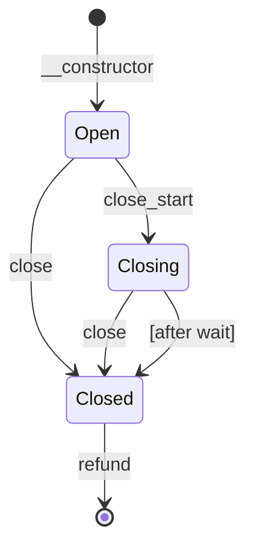

# Channel

A unidirectional payment channel contract for Soroban (Stellar).

A payment channel allows a funder to make many small payments to a recipient
off-chain, with only two on-chain transactions: opening the channel and
closing it. This avoids per-payment transaction fees and latency.

> [!WARNING]
> **The contracts in this repository have not been audited.**

## Participants

- **Funder (`from`)**: Deposits tokens into the channel and signs
  commitments authorizing the recipient to settle or close the channel
  and receive a given amount.
- **Recipient (`to`)**: Receives commitments off-chain and can settle or
  close the channel on-chain at any time using a signed commitment.

## Expectations

Participants have the following responsibilities to receive the funds owing
to them.

### Funder

- Keeping the private key corresponding to `commitment_key` (the commitment signing key) secret.

### Recipient

- Verifies the `refund_waiting_period` at channel creation is long
  enough to allow them to react to a close_start event.
- Verifies the `amount` in each commitment is less than the channels
  balance.
- Monitors the channel for [`event::Close`] events.
- Calls `settle` with a commitment promptly after seeing a close_start
  event, before the funder calls `refund`.

## State diagram


```mermaid
stateDiagram-v2
    [*] --> Open: __constructor
    Open --> Closed: close
    Open --> Closing: close_start
    Closing --> Closed: close
    Closing --> Closed: [after wait]
    Closed --> [*]: refund
```

`top_up`, `settle`, and `close` can be called in any state.

## Functions

### Lifecycle

| Function | Description |
|---|---|
| `__constructor` | Open a channel with an initial deposit. Callable by the deployer, authorized by the funder. |
| `top_up` | Deposit additional tokens into the channel. |
| `settle` | Withdraw funds using a signed commitment without closing the channel. |
| `close` | Close the channel using a signed commitment, withdrawing funds to the recipient. Automatically attempts to refund the funder. |
| `close_start` | Begin closing the channel, effective after a waiting period. |
| `refund` | Refund the remaining balance to the funder after the close is effective. |

### Helpers

| Function | Description |
|---|---|
| `prepare_commitment` | Generate the commitment bytes to sign. |

### Getters (static)

| Function | Description |
|---|---|
| `token` | Returns the token address. |
| `from` | Returns the funder address. |
| `to` | Returns the recipient address. |
| `refund_waiting_period` | Returns the refund waiting period in ledgers. |

### Getters (dynamic)

| Function | Description |
|---|---|
| `deposited` | Returns the total amount deposited. |
| `balance` | Returns the current balance. |
| `withdrawn` | Returns the total amount already withdrawn. |

## Lifecycle

### 1. Open

The channel is deployed with a SEP-41 token, funder address, recipient
address, an ed25519 `commitment_key` (public key), an initial deposit
amount, and a `refund_waiting_period` (in ledgers).

The funder's tokens are transferred into the channel contract on deployment.
The funder can also top up the channel later using [`Contract::top_up`], or
by transferring the token directly to the channel contract address.

### 2. Off-chain payments

The funder makes payments by signing commitments off-chain and sending them
to the recipient. A commitment authorizes the recipient to settle or
close the channel and receive a **cumulative total** amount. Each new
commitment replaces the previous one.

For example:
- Commitment for 100: recipient can settle or close and receive 100.
- Commitment for 140: recipient can settle or close and receive 140
  (40 more if 100 was already settled).

A commitment is an XDR serialized [`Commitment`] struct containing a domain
separator (`chancmmt`), the network ID, the channel contract address, and
the amount. The
funder signs the serialized bytes with the ed25519 key corresponding to the
`commitment_key`. Use [`Contract::prepare_commitment`] as a convenience to
generate the bytes to sign.

The serialized commitment is an XDR `ScVal::Map` with four entries
(sorted alphabetically by key):

```text
ScVal::Map({
    Symbol("amount"):  I128(amount),
    Symbol("channel"): Address(channel_contract_address),
    Symbol("domain"):  Symbol("chancmmt"),
    Symbol("network"): BytesN<32>(network_id),
})
```

### 3. Settle

The recipient calls [`Contract::settle`] at any time with a commitment
amount and its signature. The contract verifies the signature, then
transfers the difference between the commitment amount and what has
already been withdrawn. If the commitment amount is less than or equal
to what has already been withdrawn, no transfer occurs.

Settlement is optional. The recipient does not need to settle at all —
[`Contract::close`] will also settle any unsettled amount. The recipient
may choose to settle periodically to receive funds without closing the
channel.

### 4. Close

The recipient calls [`Contract::close`] with a commitment amount and its
signature. Like `settle`, only the difference between the commitment
amount and what has already been withdrawn is transferred.

After transferring the committed funds, the close function automatically
attempts to refund the remaining balance to the funder. This refund attempt
uses `try_transfer` and will silently succeed or fail without affecting the
withdrawal. If the automatic refund fails, the funder can call
[`Contract::refund`] to reclaim the remaining balance.

Like `settle`, can be called even after the channel is closed, up until
the funder calls [`Contract::refund`] and the balance is drained.

### 5. Close Start

The funder calls [`Contract::close_start`] to begin closing the channel.
The close does not take effect immediately — there is a waiting period of
`refund_waiting_period` ledgers.

The recipient can still call [`Contract::settle`] or [`Contract::close`]
during and after the waiting period. Once the waiting period has elapsed,
the funder can call `refund` to reclaim the remaining balance.

**Important:** The recipient should monitor for [`event::Close`] events and
settle or close before the funder calls `refund`.

### 6. Refund

After the refund waiting period has elapsed, the funder calls
[`Contract::refund`] to reclaim whatever balance remains in the channel.
This transfers the **entire** remaining token balance to the funder,
including any amount the recipient was entitled to but did not settle or
close for.
The contract does not reserve funds for the recipient. If the recipient
has not closed before the funder calls refund, those funds are lost to
the recipient and assumed to be of no interest to the recipient.

## Security

- Commitments are signed with an ed25519 key, not a Stellar account. The
  `commitment_key` is set at deployment and cannot be changed.
- The commitment includes a domain separator, the network ID, and the
  channel contract address, preventing signatures from being reused across
  networks, channels, or confused with other signed payloads.
- The refund waiting period protects the recipient: it gives them time to
  settle or close using their latest commitment before the funder can
  reclaim funds.

# Channel Factory

A factory contract for opening channel contracts on Soroban (Stellar).

The factory stores a channel contract wasm hash and opens new channel
instances using it. An admin can update the wasm hash to open newer
versions of the channel contract.

## Functions

| Function | Description |
|---|---|
| `__constructor` | Initialize the factory with an admin and channel wasm hash. |
| `set_wasm` | Update the stored channel wasm hash. Admin only. |
| `open` | Deploy a new channel contract with the given parameters. |
| `admin` | Returns the admin address. |
| `wasm_hash` | Returns the stored channel wasm hash. |

# Clearing

An optimistic payment clearing contract for Soroban (Stellar),
implementing the settlement-chain side of the Bajillion protocol
described in [Keep the Change](https://commonware.xyz/blogs/clearing).

Bajillion is an optimistic clearing protocol for many-to-many payments at
massive scale. Payments flow off-chain through a non-custodial operator
selected by the sender. At each settlement the epoch's activity becomes a
few-kilobyte commitment: one row per changed account, regardless of how
many payments changed it. For a given set of accounts, one payment or a
bajillion costs the same to settle.

> [!WARNING]
> **The contracts in this repository have not been audited.**

## Participants

- **Accounts**: Identified by a registry index and an ed25519 key bound in
  the account's state leaf. Accounts sign debits (payments), exits
  (withdrawals), and unwind claims with this key.
- **Operator**: Serves payments off-chain, countersigning each accepted
  payment with a receipt, and builds epoch closes. The operator is
  non-custodial: funds never leave the contract except to released
  withdrawals and unwind claims.
- **Validators**: A fixed committee that exhaustively verifies each
  close's public corpus off-chain and signs its header. The contract
  accepts a close only with a quorum certificate.
- **Challengers**: Anyone holding a signed payment pair (typically payers,
  recipients, or watchtowers acting for them) can submit a one-shot
  challenge that proves a close contradicts a retained receipt.

## The clearing model

Each account's persistent state is a leaf
`(active, balance, credit, debit, key, receipts)` in a fixed-capacity
Merkle registry. The registry's root is the **state root**. An epoch `e`
starts from `StateRoot_e`, fixes its boundary (deposits and user-signed
withdrawals), accepts payments off-chain, and closes by committing:

- One **row** per changed account, strictly sorted by account index,
  carrying the account's opening and closing leaves, its terminal
  outgoing pair when it sent, the Merkle root of its receive-shard tips
  (the **credit root**), and a running prefix total over the sorted rows.
- A **change root**: a Merkle root binding the exact row count and every
  row in order.
- A **header** `(StateRoot_e, ChangeRoot_e, StateRoot_e+1, D_e, C_e, F_e,
  W_e, ...)` signed by a quorum of validators.

The contract verifies the certificate, opens the terminal row against the
change root to check the header's totals, checks the chain-sealed boundary
(`F_e` and `W_e` must consume exactly the deposit and exit records the
contract recorded), and enforces the conservation laws:

```text
D_e = C_e                        (gross debits equal gross credits)
L_e+1 = L_e + F_e - W_e          (liability changes only by boundary flows)
```

Everything else — per-row balance equations, prefix continuity, the
paired sparse witness that recomputes both state roots, credit-root
reconstruction — is verified off-chain by the validator committee before
it signs. The complete public corpus must remain retrievable through the
challenge deadline.

## Off-chain payments

To send `x > 0`, the payer signs the exact next cumulative debit and the
operator accepts by advancing one of the recipient's receive shards and
countersigning a receipt:

```text
S = Sign_a(epoch, a -> b: x, D_a + x)
R = Sign_op(epoch, b, shard, x, TxId(S), (G + x, J + 1))
```

The matching pair `(S, R)` is the accepted payment and the
preconfirmation, and doubles as the evidence that holds the close honest.
`TxId(S)` is the SHA-256 of the XDR serialized send body. Receive shards
let a hot recipient's incoming path scale in parallel: payments assigned
to different shards never contend, and one terminal tip per shard
represents any number of payments.

All signed payloads are XDR serialized structs carrying a domain
separator, the network id, and this contract's address, preventing reuse
across networks, deployments, or payload kinds. See
[`Contract::prepare_send`], [`Contract::prepare_receipt`],
[`Contract::prepare_exit`], and [`Contract::prepare_claim`].

## The unavoidable challenge

A validity proof over the public corpus cannot prove the nonexistence of
an additional privately delivered receipt, so every close waits out a
challenge window before finalizing. Through the inclusive deadline any
holder may submit one of four bounded, non-interactive contradictions:

| # | Challenge | Function | Contradiction |
|---|---|---|---|
| 1 | Payer debit | `challenge_debit` | A matching pair carries a debit above the account's public debit marker. |
| 1 | Payer debit | `challenge_debit_body` | A matching pair carries the same debit as the row's terminal pair but a different send or receipt body. |
| 2 | Higher shard tip | `challenge_tip` | A retained receipt strictly exceeds the shard tip bound in the row's credit root. |
| 2 | Higher shard tip | `challenge_tip_absent` | A retained receipt names a shard the credit root proves absent (tip `(0, 0)`). |
| 2 | Higher shard tip | `challenge_tip_no_row` | A retained receipt credits an account the close proves rowless (tip `(0, 0)`). |
| 3 | Receipt range | `challenge_range` | Two receipts in one shard whose credits cannot bracket the payments between them. |
| 4 | Receipt fork | `challenge_fork` | Two distinct receipt bodies reuse a receipt index or acknowledge one send differently. |

A successful challenge blocks the contested close and every pending
descendant from finalizing (the queue is truncated). Earlier pending
closes keep their ordinary challenge windows. The operator may submit a
corrected close for the invalidated epoch.

## Exits and the deadline

Every account holds a unilateral exit: a signed withdrawal
`Q = Sign_a(root, destination, amount, full_close, deadline)` queued
directly on-chain with a Merkle proof of affordability against the
finalized root. The operator neither submits nor approves it. A close
consumes queued exits in order as part of its chain-sealed boundary, and
once that close finalizes anyone can `release` the payment to the signed
destination.

If an exit is still unreleased when its deadline passes, the first call
to `freeze` permanently stops new deposits, exits, and closes. Pending
closes still resolve from the front — each finalizes when its window
closes, or falls to a challenge — and terminal unwind opens against the
last finalized root:

- `unwind_exit` pays queued, unconsumed exits to their signed
  destinations, capped by the account's proven balance.
- `unwind_claim` pays an account's remaining balance to a destination
  signed by the account key, against one Merkle proof.
- `unwind_deposit` refunds deposits no finalized close consumed to their
  depositors.

Custody never leaves the chain: withdrawals stay inside until their own
close finalizes at the queue front, so the operator can stop serving
payments, but it cannot take funds or send them without authorization.

## Functions

### Lifecycle

| Function | Description |
|---|---|
| `__constructor` | Deploy with a token, operator key, validator committee, quorum, registry depth, challenge window, and minimum exit delay. |
| `deposit` | Deposit tokens for an account key. Recorded as a boundary record for the next close. |
| `exit` | Queue a signed withdrawal with a proof of affordability against the finalized root. |
| `submit` | Submit a certified close for the next epoch into the pending queue. |
| `finalize` | Finalize the front of the pending queue after its challenge window. |
| `release` | Pay a withdrawal consumed by a finalized close to its signed destination. |
| `freeze` | Permanently freeze new work after an exit deadline is breached. |

### Challenges

| Function | Description |
|---|---|
| `challenge_debit` | Prove a retained pair's debit exceeds the public debit marker. |
| `challenge_debit_body` | Prove a retained pair differs from the terminal pair at the same debit. |
| `challenge_tip` | Prove a retained receipt exceeds a shard tip bound in the close. |
| `challenge_tip_absent` | Prove a retained receipt names a shard the close binds as absent. |
| `challenge_tip_no_row` | Prove a retained receipt credits an account with no row in the close. |
| `challenge_range` | Prove two receipts in one shard are mutually inconsistent. |
| `challenge_fork` | Prove the operator signed two forking receipts. |

### Terminal unwind

| Function | Description |
|---|---|
| `unwind_exit` | Pay a queued, unconsumed exit against the last finalized root. |
| `unwind_claim` | Claim an account's remaining balance with a Merkle proof and a signed destination. |
| `unwind_deposit` | Refund a deposit no finalized close consumed. |

### Helpers

| Function | Description |
|---|---|
| `prepare_send` | Generate the send payload bytes a payer signs. |
| `prepare_receipt` | Generate the receipt payload bytes the operator signs. |
| `prepare_exit` | Generate the exit payload bytes an account signs. |
| `prepare_claim` | Generate the unwind claim payload bytes an account signs. |

### Getters

| Function | Description |
|---|---|
| `token` | The custody token address. |
| `operator_key` | The operator's receipt signing key. |
| `validators` | The validator committee keys. |
| `quorum` | The certificate quorum size. |
| `registry_depth` | The account registry tree depth. |
| `challenge_window` | The challenge window in ledgers. |
| `min_exit_delay` | The minimum ledgers between queueing an exit and its deadline. |
| `frozen` | Whether new work is frozen. |
| `next_epoch` | The next epoch a close can be submitted for. |
| `finalized_epoch` | The number of finalized closes. |
| `finalized_root` | The last finalized state root (the genesis root before any close). |
| `finalized_liability` | The total balance the registry owes accounts at the finalized root. |
| `custody` | The token balance held by the contract. |
| `slot` | A pending or finalized close by epoch. |
| `deposit_count` / `deposit_record` | Deposit boundary records. |
| `exit_count` / `exit_record` | Exit boundary records. |
| `pending_exits` | The total queued, unpaid exit amount for a key. |
| `unwound` | The total already paid to a key during terminal unwind. |

## Trust model and deviations

The contract trusts a quorum of the validator committee for the
correctness of everything it does not check itself (per-row balance
equations, registration validity, exit re-affordability at pending
roots). Retained receipts keep even a colluding operator and committee
from finalizing a close that drops or understates accepted payments, and
`freeze` plus terminal unwind guarantee recovery through the settlement
chain alone. Known simplifications relative to the blog post:

- The validator committee is fixed at deployment; rotation is out of
  scope.
- A withdrawal releases exactly its signed amount. The `full_close` flag
  is carried in the signed payload and honored during terminal unwind
  (the exit drains the account's proven balance), but committee policy
  governs account deactivation inside closes.
- Receipts naming a key that never appears in the registry are not
  challengeable on-chain: the debit and tip challenges authenticate the
  recipient's key through its registry leaf. Registration completeness is
  part of what the committee attests.
- Data availability of the public corpus (rows, shard vectors, witness)
  through the challenge deadline is assumed, as in the blog post, via
  committee assignment and quorum intersection.
